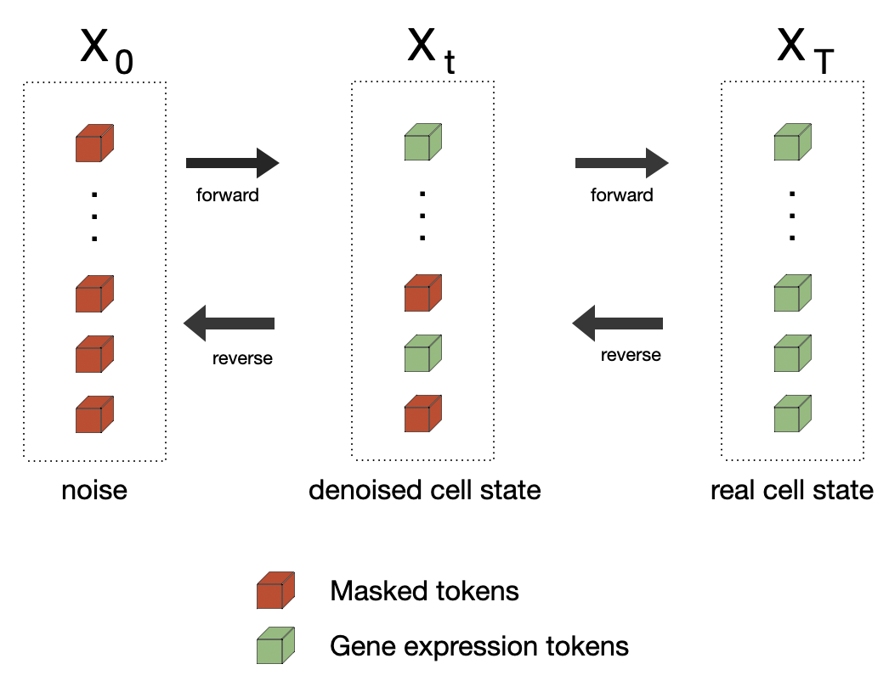

# Discrete Cell Models (DCM) 

score entropy discrete diffusion for gene expression prediction 

We introduce a diffusion-based framework that learns cellular representations directly in the discrete domain. Our framework supports both unconditional and conditional generation, allowing for precise modeling of complex biological scenarios such as cell-type-specific transcriptional responses to genetic perturbations. We demonstrate that DCM scales effectively and achieves strong performance against current state-of-the-art methods, including scVI, CPA, STATE, scGPT, and scLDM. 




# Installation 
You need to have Python 3.10 or newer installed on your system. We recommend installing [uv](https://github.com/astral-sh/uv). <br> 
Use `uv run` assumes you already have an environment with dependencies installed.

# Training 
``` 
uv run scripts/train_perturbseq.py \ 
CONFIG=configs/perturb_seq_small.yaml \
TRAIN_DATA_PATH= datasets/replogle.h5ad \
COND_LABELS_PT_PATH= datasets/protein_embeddings.pt
```

# Sampling (inf)

``` 
uv run scripts/infernce_conditional.py \ 
EXPERIMENT_DIR=experiments/dcm \
CELL_TYPE=hepg2 \
NUM_SAMPLES_PER_PERT=1000 \
NUM_STEPS=100 
```

# Acknowledgements 
This repository builds heavily off of [score sde](https://github.com/yang-song/score_sde_pytorch), [sedd](https://github.com/louaaron/Score-Entropy-Discrete-Diffusion/tree/main), [DiT](https://github.com/facebookresearch/DiT) and [STATE](https://github.com/ArcInstitute/state), [scDLM](https://github.com/czi-ai/scLDM). We also used the [cell-load](https://github.com/ArcInstitute/cell-load) package introduced in the STATE repository. 

# Data + Reproducibility 
`dentate-gyrus`: https://figshare.com/articles/dataset/Dentate_Gyrus_dataset/23354174?file=41110652 <br> 
`replogle` : https://plus.figshare.com/articles/dataset/_Mapping_information-rich_genotype-phenotype_landscapes_with_genome-scale_Perturb-seq_Replogle_et_al_2022_processed_Perturb-seq_datasets/20029387 <br> 
`pbmc-1m` : https://figshare.com/articles/dataset/pbmc_parse/28589774?file=53372768 <br> 


# Citation
If you find our work and/or our code useful, please cite us via: 
```
coming soon 
``` 

